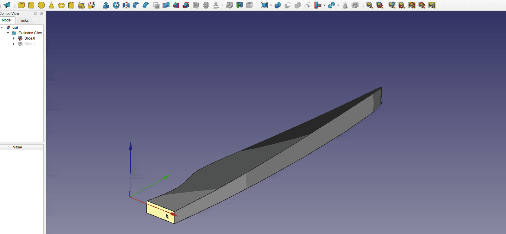

# Cadwing
_**Create wings, fan, propeller or wind-turbine blades in FreeCAD with Python**_
This python script use two faces (from a surface or a solid) to generate a wing. 
This script makes building oddly curved and twisted wings easy.

The script will generate sections, and then apply a loft across them.
The curvature is computed to adapt the space between sections.

The use of multiples airfoil is possible on the same wing.

## Usage
The main script is cadwing.py.

Two faces must be selected in FreeCAD, or their names must be provided in the script. 
The first one serve as the wing root plane for the algorithm,
the chordline of the subsequent foil sections will be parallel to this face.
The second face must be the chordline surface, which gives the overall shape of the wing.

**Note** : The foil sections are perpendicular to the chordline surface.

The chordline surface can easily be drawn with the sketch workbench,
and then, using extrusion and boolean operations, it is easy to obtain a surface or a solid's face with the right shape.

The leading edge and trailing edges can be swapped in the python script.
The sections can also be flipped upside down.

